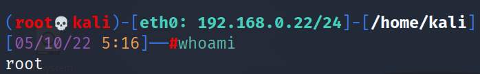
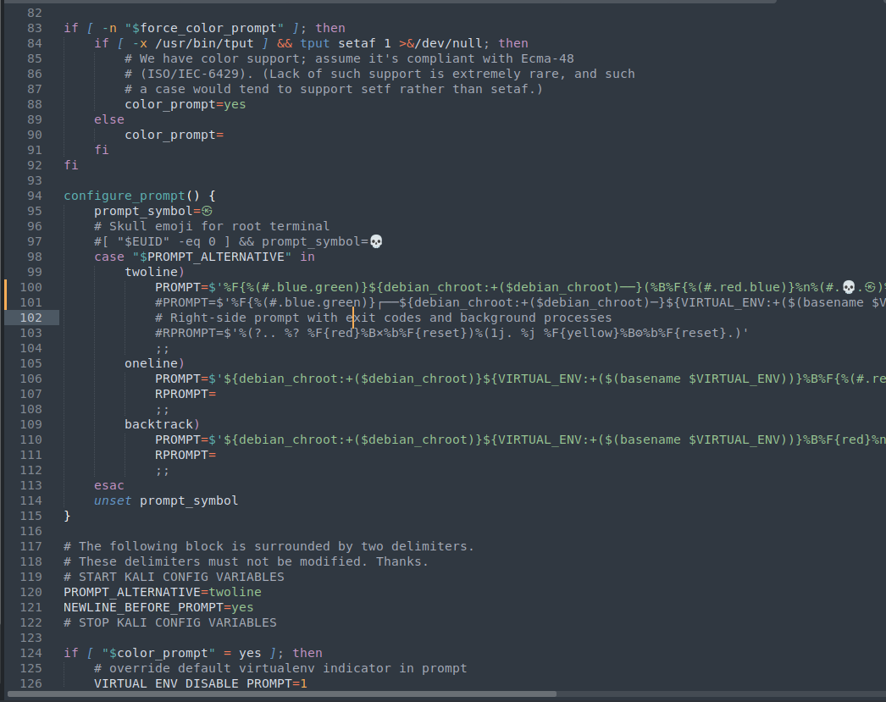

# My ZSH Prompt 

Nothing special here just sharing my ZSH prompt. I like is because it gives me the key info  and when copying out commands for testing notes I can get the time and date aswell 

## Install 

I use this on Kali - no clue how it plays ball on other distros.. i would assmume u may be alrght 

1) take a backup of you .zshrc file  you likely wont need this but always good idea to take a backup

`cp /root/.zshrc /root/.zshrc.bak`

2) open up .zshrc in a text editor 

`subl /root/.zshrc`

3) find the **configure_prompt** function and comment out the **PROMPT** variable within the **twoline** case 

4) on the line below paste in the code from **prompt.txt**

## Furture

I will put out a few variants/different colours when i can be botherd