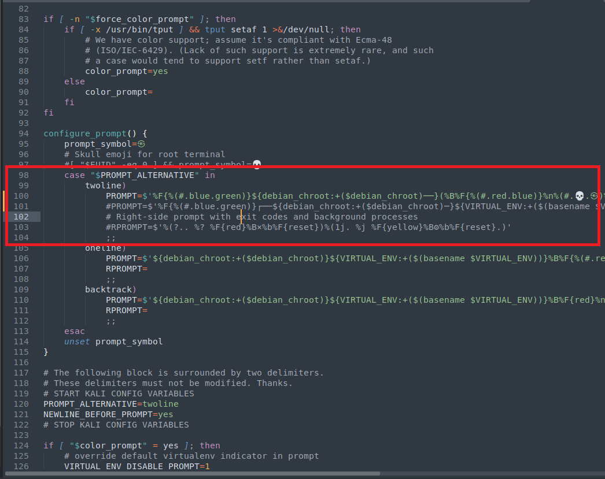

# shiftys-zsh-theme

This is my zsh theme. i mishmashed a few  together with the kali one. I like is because it gives me the key info  and when copying out commands for testing notes I can get the time and date aswell 

## Install 

I use this on Kali - no clue how it plays ball on other distros.. i would assmume u may be alrght 

1) take a backup of you .zshrc file  you likely wont need this but always good idea to take a backup

`cp /root/.zshrc /root/.zshrc.bak`

2) open up .zshrc in a text editor 

`subl /root/.zshrc`

3) find the **configure_prompt** function and comment out the **PROMPT** variable within the **twoline** case 

4) On the line below paste in the code from [prompt.txt](https://raw.githubusercontent.com/shifty0g/zsh-prompt/main/prompt.txt)

If your primiary interface is not **eth0** then change it 

5) Save and close. Open up a new terminal tab and you should have a new snazzy prompt.

## Future

I will put out a few variants/different colours when i can be botherd. im thinking green and yellow 
